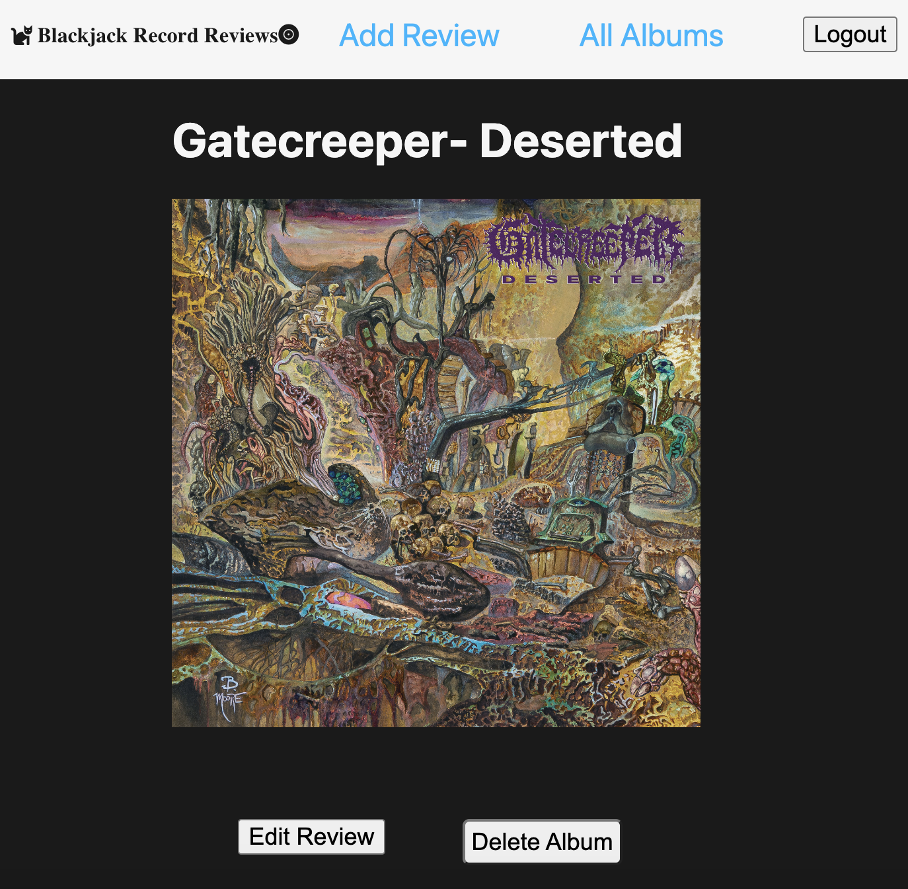

# Blacjack Record Reviews

## [Click here to start the app!](https://blackjackrecordreviews.fly.dev/)

## [Trello Board] (https://trello.com/b/sjy84xAB/blackjack-record-reviews) 

## Technologies used 💾

Mongoose

## Attributions
  Favicon created in Favicon.io.  

## Recent Changes 🧹
- Added text box

- Added favicon.

- Edit button for making changes to review.

- Delete button for removing a review.

- Add an image url to upload album artwork for the review.

- Includes Google OAuth.

## Ice Box 🧊

[] - Include link to a song correspondent to the album review. 

[] - Include a 5 star rating system to an album review.

[X]- Add comments on a review

[] - Delete comments on a review
